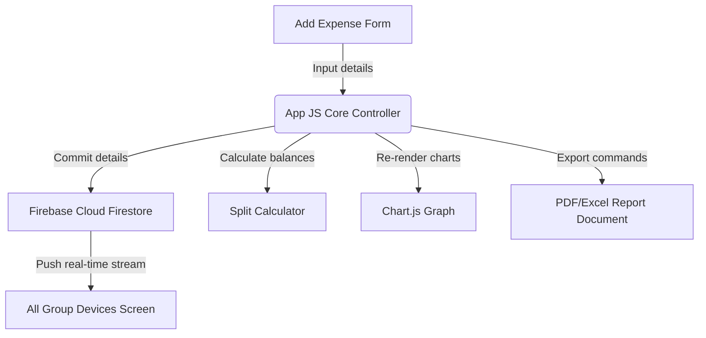

# ⛰️ Wayanad Trip Expense Manager

[](https://www.w3.org/)
[](https://getbootstrap.com/)
[](https://firebase.google.com/)
[](https://www.chartjs.org/)

A collaborative, real-time web utility designed to track, distribute, and split expenses for group travels. Features cloud synchronization, visual spending analytics, and report exports to simplify trip settlement.

---

## 🚀 Key Features

- **Real-Time Group Sync**: Connected to Firebase Firestore. Bills and costs uploaded on one device are synced instantly across all screen sessions.
- **Fair-Split Calculation Engine**: Automatically calculates balance debts, detailing who owes whom and the minimum cash transfers required to settle the trip ledger.
- **Interactive Expense Visualization**: Integrated with Chart.js to render responsive charts categorizing total trip spends (e.g., Food, Travel, Stay, Activities).
- **Comprehensive Document Exports**:
  - **PDF Export**: Generates clean printable receipt tables using `jsPDF` and `jsPDF-AutoTable`.
  - **Excel Export**: Exports full tabular transaction files using `xlsx` (SheetJS).
- **Modern Responsive UI**: Styled with Bootstrap 5 templates, optimized for mobile screen dimensions.

---

## 🛠️ Technology Stack

- **Frontend Core**: HTML5, CSS3 (Custom grid extensions)
- **CSS Styling Framework**: Bootstrap 5
- **Icons**: Bootstrap Icons CDN
- **Database Backend**: Firebase Cloud Firestore
- **Charts & Graphs**: Chart.js
- **Export Engines**: jsPDF, jsPDF-AutoTable, SheetJS (XLSX)

---

## 📂 Project Directory Structure

```
├── index.html             # Core webpage structure and script CDNs
├── style.css              # Custom overrides, theme colors, and layout patches
├── app.js                 # Firebase initialization, calculations, and chart renders
└── README.md              # Project documentation
```

---

## ⚙️ Setup & Execution

### Prerequisites
To use the real-time syncing features, you'll need to set up a Firebase Project.

### Steps to Run

1. **Clone the Repository:**
   ```bash
   git clone https://github.com/ATHITHYAN-S-developer/wayanad.git
   cd wayanad
   ```

2. **Configure Firebase Credentials:**
   Open `app.js` and update the `firebaseConfig` object with your Firebase Web App credentials:
   ```javascript
   const firebaseConfig = {
     apiKey: "YOUR_API_KEY",
     authDomain: "YOUR_PROJECT_ID.firebaseapp.com",
     projectId: "YOUR_PROJECT_ID",
     storageBucket: "YOUR_PROJECT_ID.appspot.com",
     messagingSenderId: "YOUR_SENDER_ID",
     appId: "YOUR_APP_ID"
   };
   ```

3. **Enable Firestore Database:**
   - Go to the Firebase Console.
   - Navigate to **Firestore Database** and click **Create database**.
   - Set rules to test mode or authorized profiles.

4. **Launch the Interface:**
   - Double-click `index.html` to open it in a browser, or run a local HTTP server:
     ```bash
     python -m http.server 8000
     ```
   - Open `http://localhost:8000` in your browser.

---

## 📈 App Workflow



---

## 🤝 Contributing

Contributions are welcome! If you have suggestions for new features, UI improvements, or additional export options, feel free to open an issue or submit a pull request.

---

## 📄 License

This project is licensed under the MIT License.
